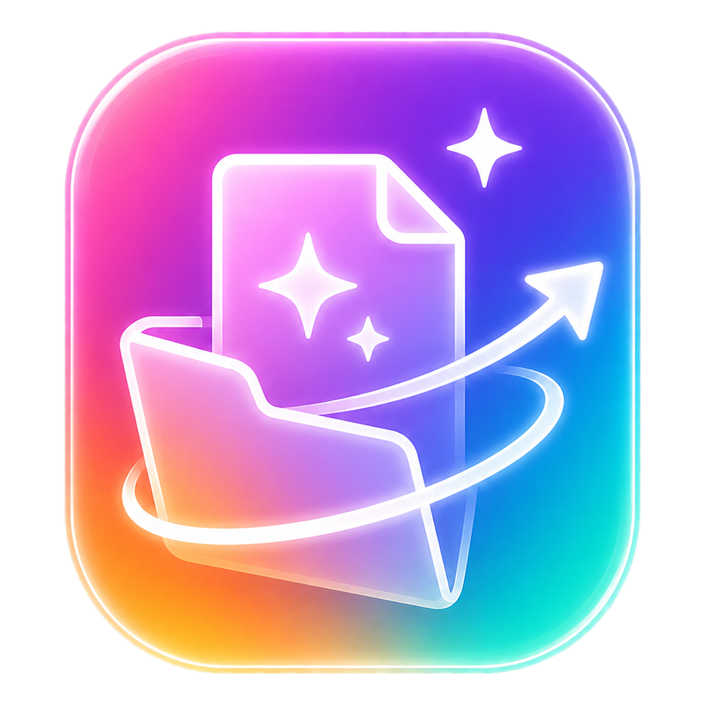

<p align="center">
  
</p>

<h1 align="center">DeSonKuPik</h1>

<p align="center">
  <strong>Beautiful one-click audio mastering for the web and desktop.</strong><br />
  Open a file, let the chain enhance it, then export a polished master.
</p>

<p align="center">
  <a href="https://github.com/masarray/desonkupik/actions/workflows/ci.yml"></a>
  <a href="https://github.com/masarray/desonkupik/actions/workflows/release.yml"></a>
  <a href="https://github.com/masarray/desonkupik/releases"></a>
  <a href="LICENSE"></a>
</p>

<p align="center">
  <a href="https://masarray.github.io/desonkupik/"><strong>Landing Page</strong></a> ·
  <a href="https://github.com/masarray/desonkupik/releases"><strong>Download</strong></a> ·
  <a href="docs/RELEASE.md"><strong>Release Guide</strong></a> ·
  <a href="LICENSING.md"><strong>Licensing</strong></a>
</p>

---

## What is DeSonKuPik?

**DeSonKuPik** is a modern audio mastering application by **SonKuPik**. It runs as a web app and as a desktop app for Windows, macOS, and Linux using Electron.

The product idea is simple:

> **Magic → open file → export becomes automatically better.**

DeSonKuPik is designed for creators who want a fast, musical, and visually elegant mastering workflow without opening a complex DAW session.

## Highlights

- **One-click mastering chain** with EQ, compressor, color, stereo width, and limiter.
- **Mas Ari Signature direction** for smooth body, enhanced clarity, and controlled top-end coherence.
- **Desktop-ready** with native file open/export dialogs.
- **Web-ready** for Cloudflare Pages or any static hosting.
- **Cross-platform builds** for Windows, macOS, and Linux through GitHub Actions.
- **Dual licensing**: GPL for open-source use and a commercial license path for proprietary use.

## Desktop downloads

Official installers are published from GitHub Releases after a tagged release build.

| Platform | Expected artifacts |
|---|---|
| Windows | `.exe` installer and portable `.exe` |
| macOS | `.dmg` and `.pkg` for Intel/Apple Silicon |
| Linux | `.AppImage`, `.deb`, and `.tar.gz` |

Unsigned builds may show Windows SmartScreen or macOS Gatekeeper warnings. Production distribution should use Windows code signing and Apple notarization.

## Local development

```bash
npm ci
npm run dev
```

Desktop development:

```bash
npm run desktop:dev
```

## Build and validation

```bash
npm run typecheck
npm run lint
npm run build
```

Desktop builds:

```bash
npm run desktop:win
npm run desktop:mac
npm run desktop:linux
```

## Release workflow

A new release can be created with a version tag:

```bash
npm version patch
git push --follow-tags
```

The release workflow builds Windows, macOS, and Linux packages and publishes them to GitHub Releases when the build is triggered by a `v*.*.*` tag.

## Cloudflare Pages

Recommended settings:

| Setting | Value |
|---|---|
| Framework preset | Vite |
| Build command | `npm run build` |
| Build output directory | `dist` |
| Node.js | 22 or newer |

Optional direct deploy after Cloudflare login:

```bash
npm run cf:deploy
```

## GitHub Pages landing page

This repository includes a professional landing page under `docs/` and a GitHub Actions Pages workflow.

After GitHub Pages is enabled for the repository, the public landing page is expected at:

```text
https://masarray.github.io/desonkupik/
```

## Licensing

DeSonKuPik is distributed under a **dual-license model**:

1. **GPL-3.0-or-later** for open-source use.
2. **Commercial license** for proprietary distribution, OEM bundling, white-label use, closed-source derivative products, commercial SaaS, or enterprise redistribution.

See [LICENSING.md](LICENSING.md) and [COMMERCIAL-LICENSE.md](COMMERCIAL-LICENSE.md).

This is not legal advice. For commercial deployment, review the final license terms with qualified counsel.

## Engineering notes

- Brand is **DeSonKuPik** only. Legacy app names should not appear in public UI.
- The desktop production build uses relative Vite asset paths so packaged Electron loads the same UI as the web app.
- The app icon, visual identity, presets, and SonKuPik marks remain SonKuPik brand assets.
- Build outputs such as `dist/`, `release/`, installers, caches, and generated binaries are excluded from source control.

## Contributing

Contributions are welcome under the GPL license path. By contributing, you agree that your contribution can be distributed under the repository's dual-license model.

Please read [CONTRIBUTING.md](CONTRIBUTING.md) before submitting issues or pull requests.

## Security

Please do not open public issues for security-sensitive reports. See [SECURITY.md](SECURITY.md).

---

<p align="center">
  Made with care by <strong>SonKuPik</strong>.
</p>
